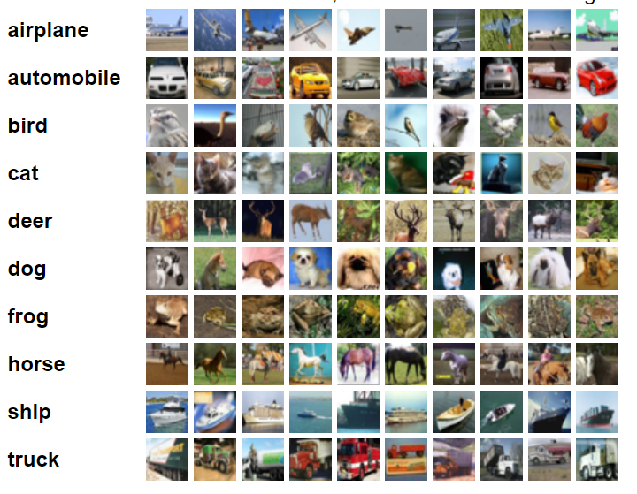

# 1. Introduction

## CIFAR-10 dataset

Get the Cifar-10 ditail at [here](http://www.cs.toronto.edu/~kriz/cifar.html)

The CIFAR-10 dataset consists of 60000 32x32 colour images in 10 classes, with 6000 images per class. There are 50000 training images and 10000 test images.

The dataset is divided into five training batches and one test batch, each with 10000 images. The test batch contains exactly 1000 randomly-selected images from each class. The training batches contain the remaining images in random order, but some training batches may contain more images from one class than another. Between them, the training batches contain exactly 5000 images from each class.

Here are the classes in the dataset, as well as 10 random images from each:


## Download
if you're going to use this dataset, you can get the dataset use `torchvision.datasets.CIFAR10` 

If you're going to use this dataset, please cite the tech report at the bottom of this page.


| Version                                                                                                     | Size                                   | md5sum                           |
|:------------------------------------------------------------------------------------------------------------|:---------------------------------------|:---------------------------------|
| [Python CIFAR-10 python version](http://www.cs.toronto.edu/~kriz/cifar-10-python.tar.gz)                    | 163 MB                                 | c58f30108f718f92721af3b95e74349a |
| [CIFAR-10 binary version (suitable for C programs)](http://www.cs.toronto.edu/~kriz/cifar-10-binary.tar.gz) | 162 MB	|c32a1d4ab5d03f1284b67883e8d87530 |                                  |

# Binary version
The binary version contains the files data_batch_1.bin, data_batch_2.bin, ..., data_batch_5.bin, as well as test_batch.bin. Each of these files is formatted as follows:
```
<1 x label><3072 x pixel>
...
<1 x label><3072 x pixel>
```
In other words, the first byte is the label of the first image, which is a number in the range 0-9. The next 3072 bytes are the values of the pixels of the image. The first 1024 bytes are the red channel values, the next 1024 the green, and the final 1024 the blue. The values are stored in row-major order, so the first 32 bytes are the red channel values of the first row of the image.

Each file contains 10000 such 3073-byte "rows" of images, although there is nothing delimiting the rows. Therefore each file should be exactly 30730000 bytes long.

There is another file, called batches.meta.txt. This is an ASCII file that maps numeric labels in the range 0-9 to meaningful class names. It is merely a list of the 10 class names, one per row. The class name on row i corresponds to numeric label i.

# 2. Preparation


## Download Cifar10 dataset
Construct an operation class of cifar10 dataset file to read binary files and get each image and corresponding classification label.<br>
Basically, all examples decompress the original cifar10 file into the specified file，I decided to read the binary file directly.<br>

## Programming environment

My computer operating system is windows11, and I have installed the latest Windows subsystem for Linux (Ubuntu 20.04). Here is my programming environment
1. Windows11 (WSL2 Ubuntu)
2. CUDA toolkit 11.5 and Cudnn 8.3.0 (both innstalled in Windows and WSL)
3. Pytorch and Libtorh(1.10 + CUDA11.3）
4. Opencv 4.5.1 (build with Visual Studio 2017)
5. Microsoft Visual Studio Community 2019 and 2022
6. Python 3.9 (WSL "`sudo apt install Opencv-Python`")

### 1. Create one project
Open the `visual studio 2022` , Create a new project name `cifar10_tutorial`（At the `Create a new project page` select the `Console App`. <br>

### 2. Project Settings

- Config project x64 

  Because I download the Libtorch is [release version](libtorch-win-shared-with-deps-1.10.0%2Bcu113.zip), so the project must select the `Solution Configurations` is Release.<br> 
  From the Visual Studio IDE menu `View `- `Other window` -`Property Manager` open the Propery Manager toolbar, delete th `Debug|x86` and `Release|x86`

  Or right click the project open the Property Pages. Change the `Configuration` is `Release`, `Platform` is `x64`

- Select C++/C Standard
    At the `Configuration Properties`--`General` sheetset `C++ Language Standard`  is `ISO C++ 17 Standard(/std:c++17)`, `C Language Standard` is `ISO C17(2018) Standar(/std:c17)` <br>
    Can also at the `C/C++ --Command Line` sheet, add this code at the `Additional Options`:
    ```
    /std:c17 /std:c++17
    ```

  add `/wd"4996"`  to `C/C++ --Command Line` 

### 3. Add libtorch and Opencv

- Libtorch

    Add libtorch include file path to project `Additional Include Directories`
    ```
    root to libtorch\include
    root to libtorch\include\torch\csrc\api\include
    ```

    Add the `root to libtorch\lib` to project `Additional Library Directories`

    Add all lib file at `root to libtorch\lib` to project `Additional Dependencies`
    ```
    c10.lib
    c10_cuda.lib
    caffe2_detectron_ops_gpu.lib
    caffe2_module_test_dynamic.lib
    caffe2_nvrtc.lib
    clog.lib
    cpuinfo.lib
    dnnl.lib
    fbgemm.lib
    fbjni.lib
    libprotobuf.lib
    libprotobuf-lite.lib
    libprotoc.lib
    torch.lib
    torch_cpu.lib
    torch_cuda.lib
    torch_cuda_cpp.lib
    torch_cuda_cu.lib
    XNNPACK.lib
    ```

- OpenCV
    Add the `root opencv\include` and `root opencv\x64\vc16\lib` to project, and add these library file to project `Additional Dependencies`:
    ```
    opencv_core451.lib 
    opencv_imgcodecs451.lib  
    opencv_highgui451.lib
    opencv_imgproc451.lib
    ```
### 4. Add the code
Refer to this article on the Internet[基于libtorch的Resnet34残差网络实现——Cifar-10分类](https://mp.weixin.qq.com/s?__biz=Mzk0NjE2NDcxMw%3D%3D&chksm=c30b0020f47c89364be7b563f9e212597e504f77d77f52a97034fb57f9afe028e8dcf4d94c03&idx=1&mid=2247485094&scene=21&sn=63407456e74015309bbe088928b82743#wechat_redirect)

[GPU module.to(device) error:c10::NotImplementedError](https://blog.csdn.net/qq_36038453/article/details/120278523?spm=1001.2101.3001.6650.3&utm_medium=distribute.pc_relevant.none-task-blog-2%7Edefault%7ECTRLIST%7Edefault-3.no_search_link&depth_1-utm_source=distribute.pc_relevant.none-task-blog-2%7Edefault%7ECTRLIST%7Edefault-3.no_search_link)

At the solution Property Pages, add the code to Linker Command Line Addtional Options:
```
/INCLUDE:?searchsorted_cuda@native@at@@YA?AVTensor@2@AEBV32@0_N1@Z
```
 

Run program ouput like this:
```
Load data from file: D:\Pytorch_learns\data\cifar-10-batches-bin\data_batch_1.bin success.
Load data from file: D:\Pytorch_learns\data\cifar-10-batches-bin\data_batch_2.bin success.
Load data from file: D:\Pytorch_learns\data\cifar-10-batches-bin\data_batch_3.bin success.
Load data from file: D:\Pytorch_learns\data\cifar-10-batches-bin\data_batch_4.bin success.
Load data from file: D:\Pytorch_learns\data\cifar-10-batches-bin\data_batch_5.bin success.
cuda is available: 1  device count: 1
cudnn is available: 1
1
alpha = 0.01 loss: 2.67121
alpha = 0.01 loss: 2.36748
alpha = 0.01 loss: 2.29476
alpha = 0.01 loss: 2.25413
alpha = 0.01 loss: 2.20015
alpha = 0.01 loss: 2.21941
alpha = 0.01 loss: 2.20743
alpha = 0.01 loss: 2.2086
alpha = 0.01 loss: 2.21216
alpha = 0.01 loss: 2.17851
alpha = 0.01 loss: 2.15054
alpha = 0.01 loss: 2.15156
alpha = 0.01 loss: 2.11263
alpha = 0.01 loss: 2.13404
alpha = 0.01 loss: 2.10592
alpha = 0.01 loss: 2.11131
alpha = 0.01 loss: 2.1424
alpha = 0.01 loss: 2.1
alpha = 0.01 loss: 2.12143
alpha = 0.01 loss: 2.1412
alpha = 0.01 loss: 2.1327
alpha = 0.01 loss: 2.13409
```